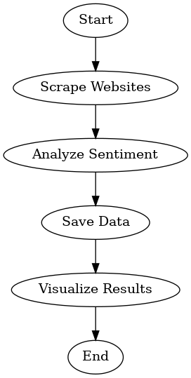

# Web Scraping and Data Analysis Pipeline

## Overview
This project demonstrates a complete pipeline for concurrent web scraping, sentiment analysis, and data visualization. It fetches news headlines from popular websites, analyzes their sentiment, and visualizes the results. The workflow uses Python's multithreading and multiprocessing capabilities to optimize performance.

---

## Features
- **Web Scraping**: Fetches headlines from BBC, CNN, and Reuters using `requests` and `BeautifulSoup`.
- **Sentiment Analysis**: Uses the VADER model from NLTK for analyzing headline sentiments.
- **Data Storage**: Saves the scraped and processed data into a CSV file.
- **Visualization**:
  - Sentiment distribution bar chart.
  - Word cloud of headlines.
  - Top 10 keywords extracted from the headlines.
- **Concurrency**:
  - Multithreading for scraping multiple websites simultaneously.
  - Multiprocessing for faster sentiment analysis of headlines.

---

## Tools and Libraries
- `requests`: For sending HTTP requests.
- `BeautifulSoup`: For parsing HTML and extracting content.
- `concurrent.futures`: For multithreading.
- `nltk` (VADER): For sentiment analysis.
- `matplotlib`: For plotting sentiment distribution.
- `wordcloud`: For generating a word cloud.
- `pandas`: For data manipulation and storage.
- `graphviz`: For creating a flowchart of the pipeline.

---

## Installation
1. Clone the repository:
   ```bash
   git clone https://github.com/your-username/web-scraping-analysis-pipeline.git
   cd web-scraping-analysis-pipeline
   ```
2. Install dependencies:
   ```bash
   pip install -r requirements.txt
   ```
   Ensure you have the following libraries installed: `requests`, `beautifulsoup4`, `pandas`, `matplotlib`, `nltk`, `wordcloud`, `graphviz`.
3. Download NLTK data for VADER:
   ```python
   import nltk
   nltk.download('vader_lexicon')
   ```

---

## How to Run
1. Open the main Python script:
   ```bash
   python main.py
   ```
2. The script will:
   - Scrape headlines from websites.
   - Perform sentiment analysis.
   - Save results in `headlines_analysis.csv`.
   - Generate and display visualizations.

---

## Output
1. **CSV File**: Contains scraped data with sentiment labels (`headlines_analysis.csv`).
   - Columns: `Website`, `Headline`, `Link`, `Sentiment`.
2. **Visualization**:
   - Sentiment distribution bar chart.
   - Word cloud of headlines.
   - Top keywords in the headlines.
3. **Flowchart**: A PNG flowchart (`processing_pipeline.png`) depicting the workflow.

---

## File Structure
```
├── main.py                   # Main script for running the pipeline
├── requirements.txt          # Python dependencies
├── README.md                 # Project documentation
├── headlines_analysis.csv    # Output CSV file (generated after running the script)
├── processing_pipeline.png   # Flowchart of the pipeline (generated after running the script)
```

---

## Flowchart of Pipeline
Below is a high-level visualization of the pipeline:

1. **Start**: Begin the process.
2. **Scrape Websites**: Use multithreading to scrape multiple websites concurrently.
3. **Analyze Sentiment**: Use multiprocessing for faster sentiment analysis.
4. **Save Data**: Save results to a CSV file.
5. **Visualize Results**: Create visualizations and extract top keywords.
6. **End**: Complete the workflow.



---

## License
This project is licensed under the MIT License. See the `LICENSE` file for more information.

---

## Contact
For any questions or feedback, please contact [agapaitanveermou@gmail.com].
